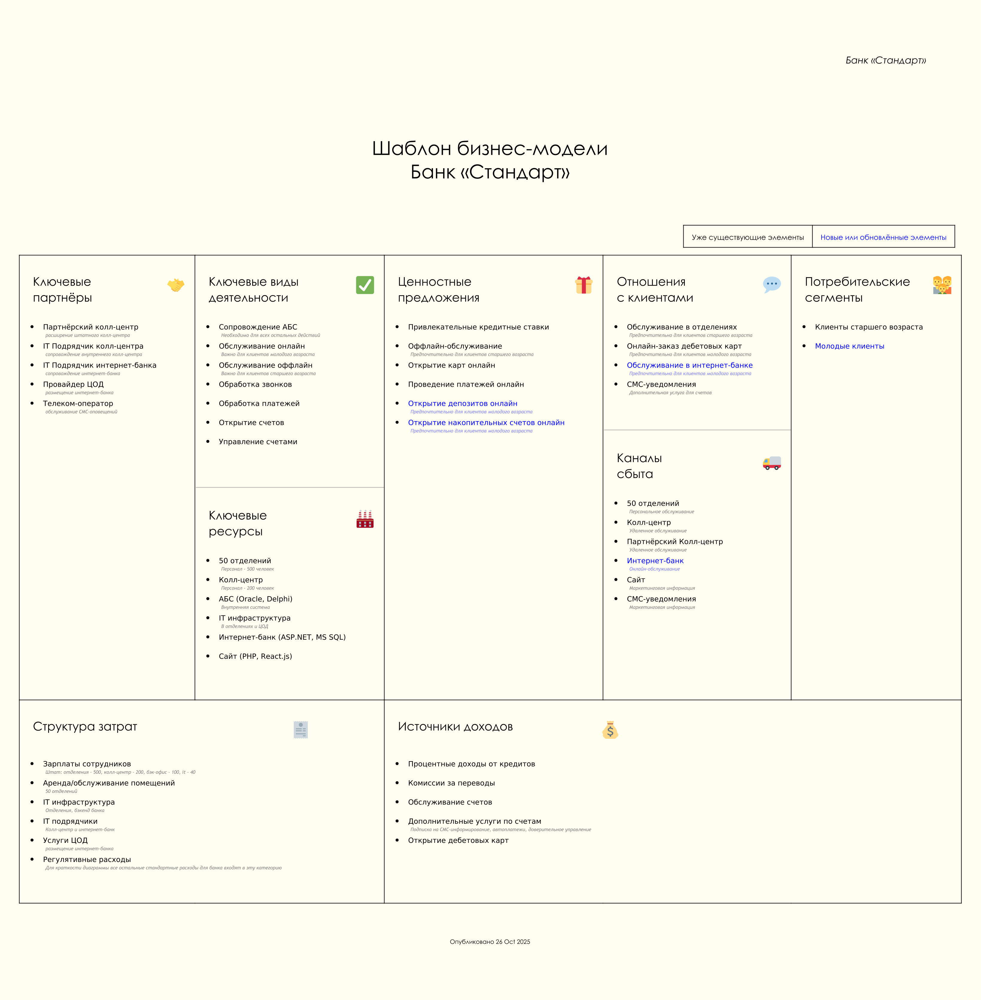

# Задание 1. Карта IT-ландшафта и схема интеграции приложений

## Описание задачи

Команде цифровой трансформации необходимо определить, что сейчас мешает сделать депозиты и накопительные счета полностью цифровым продуктом, который будет доступен в интернет-банке.

Владелец продукта уже просчитал бюджет бизнес-модели и частично проанализировал процессы. Текущая модель предполагает большие издержки на процессы, в которых задействованы сотрудники бэк-офиса. Их процесс не позволяет мгновенно открывать депозиты.

## Процесс открытия депозита

### Текущее состояние

Сейчас процесс выглядит так:

1. **Базовый процесс расчета ставок:**
   - Клиент может подать заявку на открытие депозита только в отделении
   - Сотрудники отдела кредитования вручную считают ставки в Excel-файле на основе ставки рефинансирования Центробанка
   - Они анализируют текущее количество выданных кредитов и депозитов в банке
   - Итоговая ставка по депозитам зависит от уровня кредитного риска банка
   - Ставка обновляется ежедневно — эти показатели передаются в бэк-офис каждый день по почте Excel-файлом

2. **Процесс с предварительным звонком в кол-центр:**
   - Если до своего визита клиент позвонил в кол-центр, чтобы уточнить детали открытия депозита, то сотрудник кол-центра заводит обращение в своей системе
   - Обращение передаётся в АБС
   - Сотрудники бэк-офиса отдельно обрабатывают заявки из кол-центра в АБС, чтобы определить ставки для таких клиентов заранее
   - Если ставка определена, то сотрудник обрабатывает заявку в АБС и указывает там ставку
   - После этого АБС отправляет СМС-оповещение клиенту о том, что он может получить депозит под указанную ставку, — для этого надо прийти в отделение

3. **Процесс без предварительного звонка:**
   - Если клиент приходит в отделение без предварительного звонка, то его заявку нельзя обработать заранее
   - В этом случае, чтобы озвучить клиенту ставку депозита, сотрудник отделения пишет письмо сотруднику бэк-офиса

4. **Процесс для клиентов со специальными ставками:**
   - Если у клиента достаточно много денег на счетах, ему могут согласовать специальные ставки
   - Чтобы их определить, сотрудники бэк-офиса обращаются в отдел кредитования
   - Сотрудник кредитования анализирует текущий уровень кредитного риска для банка в своём разделе АБС относительно этого клиента и передаёт данные в письме
   - Эти данные менеджер депозитов добавляет в Excel-файл и вычисляет на их основе ставку
   - Он посылает её ответным письмом сотруднику фронт-офиса

### Завершение процесса

Процесс выглядит так, потому что сотрудники депозитов и сотрудники кредитов не должны иметь доступа к данным друг друга по требованиям безопасности. 

Когда клиент узнаёт ставку и подтверждает открытие депозита:
1. Сотрудник фронт-офиса создаёт депозит в АБС
2. Выдаёт клиенту необходимые документы
3. Когда документы подписаны, сотрудник загружает их в АБС

### Временные рамки

Пока проходят все этапы согласования, клиент ожидает в отделении:
- **Обычный процесс:** 20 минут
- **Специальные ставки:** до часа

## Материалы

## Что нужно сделать

У вас есть Business Capability Map, а также описание организационной структуры предприятия и процессов. На основе этих данных создайте в draw.io:

1. **Карту текущего IT-ландшафта**
   - В строках она должна содержать элементы организационной структуры
   - В колонках — бизнес-возможности второго уровня
   - Например, в строке стоит кол-центр, а в колонке — продажи через кол-центр

2. **Схему интеграции приложений** с указанием участников процессов

## Результат

