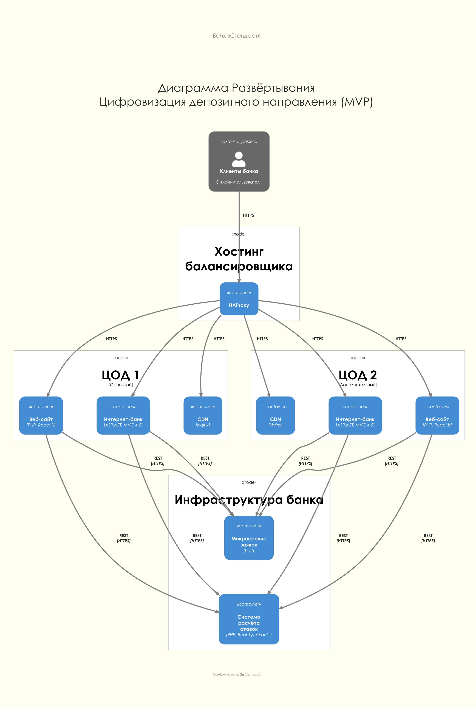

### Название задачи: MVP цифровизации депозитного направления
### Автор: ЦК Архитектуры
### Дата: 2025-10-10

### Функциональные требования

### Нефункциональные требования

### Решение

#### Context As Is

#### Context To Be

#### Container As Is

#### Container To Be

#### Component To Be

#### Deployment To Be

Как минимум в ЦОД должны быть интернет-банк и веб-сайт. В ЦОД могут быть и микросервисы, в зависимости от необходимости масштабирования.
Схема развёртывания от этого не принципиально поменяется.

### Покрытие FURPS решением

### Обоснование решений

Основные решения направлены на исправление проблем, мешающих внедрению MVP. Проблемные зоны отмечены красным на [Диаграмме Интеграции Приложений](../task1/doc/application-integration-map.png)

- **Расчёт ставок**
  
  В текущей системе расчёт ставок происходит вручную в XLS. Это совсем не масштабируемое и не контролируемое решение.
  В качестве замены выбрана реализация в виде небольшой микросервисной системы, которая может заменить XLS.
  - **Плюсы**:
    - Система нарочно спроектирована минимальной, чтобы её реализация была как можно дешевле и быстрее.
    - В системе легко организовать аудит и RBAC.
    - В системе легко организовать выгрузку нужных данных с любой частотой в любой формат.
    - Нет риска человеческих ошибок при выгрузках или расчёте ставок.
  - **Минусы**:
    - Ещё одна система в банке, которую нужно будет поддерживать.
    - Для сотрудников бек-офиса нужно будет обучение.

- **Микровервис Платежей**
  
  В текущей системе интернет-банк работает напрямую с базой данных АБС через SQL. Команда АБС утверждает, что база данных системы уже перегружена. Микросервис Платежей создаёт промежуточный слой между интернет-банком и АБС.
  - **Плюсы**:
    - Снижает нагрузку на базу данных АБС, которая уже перегружена.
    - Создаёт слой абстракции между интернет-банком и АБС, что упрощает будущие изменения в обеих системах.
    - Использует PHP — в банке уже есть экспертиза (веб-сайт разработан на PHP).
    - Позволяет постепенно мигрировать от монолитного интернет-банка к микросервисной архитектуре.
    - Может кэшировать данные для ускорения отклика.
    - Легко масштабируется горизонтально, в отличие от АБС, которая может масштабироваться только вертикально.
    - Позволяет независимо обновлять логику платежей без изменения интернет-банка или АБС.
  - **Минусы**:
    - Дополнительная система, которую нужно разрабатывать, развёртывать и поддерживать.
    - Увеличивает операционные расходы (серверы, мониторинг, обслуживание).
    - Дополнительная точка отказа в системе — если микросервис полностью упадёт, платежи в интернет-банке работать не будут.
    - Команде нужно получить экспертизу в микросервисной архитектуре, если её ещё нет.
    - Приходится с АБС через SQL, так как саму АБС переписывать будет слишком дорого.

- **Микровервис Заявок**
  
  В текущей системе заявки на депозиты обрабатываются вручную через электронную почту и напрямую в АБС. Микросервис Заявок централизует всю логику работы с заявками как для веб-сайта, так и для интернет-банка.
  - **Плюсы**:
    - Единая точка управления заявками для всех каналов (веб-сайт, интернет-банк), что упрощает поддержку и доработку.
    - Снижает нагрузку на перегруженную базу данных АБС за счёт изоляции процесса приёма заявок.
    - Адаптеры для разных протоколов упрощают интеграцию с АБС и системой колл-центра.
    - Кэш состояния заявок (Redis/memcached) значительно ускоряет отклик системы — данные доступны за миллисекунды, а не секунды.
    - Асинхронная отправка СМС через pub-sub не блокирует основной процесс обработки заявки.
    - Использует PHP — в банке есть готовая экспертиза (веб-сайт).
    - Может масштабироваться горизонтально независимо от других систем.
    - Обеспечивает единый источник правды о статусе заявок.
    - Упрощает переход к полностью автоматическому процессу открытия депозитов в будущем.
  - **Минусы**:
    - Ещё одна система в банке, которую нужно будет разрабатывать и поддерживать.
    - Требуется новая инфраструктура: серверы, система мониторинга, Redis/memcached.
    - Более сложное развёртывание и диагностика проблем по сравнению с монолитом.
    - Риск рассинхронизации данных между кэшем и АБС при сбоях.
    - Команде нужна экспертиза в микросервисной архитектуре и работе с очередями сообщений (pub-sub).
    - Усложняется процесс тестирования — нужно тестировать интеграции с множеством систем.

### Альтернативы

- **Расчёт ставок**
  
  Возможные альтернативные решения:
  - Не менять ничего, но добавить возможность выгрузки данных из XLS во внешне доступные файлы.
    - **Плюсы**:
      - Нет необходимости менять существующую систему. Очень дёшево.
    - **Минусы**:
      - Ручная обработка снижает производительность отдела депозитов.
      - Повышается риск человека ошибиться при расчёте ставок.
      - Задержка между расчётом ставок и их внесением в систему.
  - Встроить расчёт ставок в АБС.
    - **Плюсы**:
      - АБС - часть уже существующей системы, экспертиза в ней уже имеется.
      - Можно встроить расчёт ставок в интерфейс АБС нативно.
    - **Минусы**:
      - Нужно будет доработать АБС, монолит которой в перспективе подразумевается разделить на модули или микросервисы.
      - Создавать в АБС точки контакта с внешним миром - опасно, это создаёт поверхность атаки для злоумышленников.

- **Микровервис Платежей**
  
  Возможные альтернативные решения:
  - Оставить прямую интеграцию интернет-банка с базой данных АБС.
    - **Плюсы**:
      - Не требуется разработка нового сервиса. Текущее решение уже работает.
      - Меньше точек отказа в системе.
    - **Минусы**:
      - База данных АБС продолжит перегружаться при росте числа клиентов.
      - Низкая производительность — справочные данные загружаются больше секунды.
      - Прямая связь интернет-банка с АБС усложняет изменения в обеих системах.
      - АБС может масштабироваться только вертикально.
  - Доработать ядро интернет-банка для работы с АБС через API вместо SQL.
    - **Плюсы**:
      - Не требуется создание нового микросервиса.
      - API-интеграция более правильная с архитектурной точки зрения, чем прямой доступ к базе.
    - **Минусы**:
      - Требует доработки АБС, что привязывает банк к монолиту ещё сильнее.
      - Не решает проблему перегруженности АБС.
      - Не позволяет горизонтально масштабировать обработку платежей.

- **Микровервис Заявок**
  
  Возможные альтернативные решения:
  - Обрабатывать заявки напрямую в интернет-банке и на сайте, передавая их в АБС.
    - **Плюсы**:
      - Не нужно создавать новый микросервис.
      - Меньше систем для поддержки.
    - **Минусы**:
      - Дублирование логики обработки заявок между сайтом и интернет-банком.
      - Дополнительная нагрузка на уже перегруженную базу данных АБС.
      - Сложнее обеспечить единый источник правды о статусе заявок.
      - Сайт и интернет-банк написаны на разных технологиях (PHP и ASP.NET), сложно синхронизировать изменения.
  - Встроить весь процесс обработки заявок в АБС.
    - **Плюсы**:
      - АБС — уже существующая система, её поддерживает внутренняя команда из 20 человек.
      - Вся логика работы с депозитами будет в одном месте.
    - **Минусы**:
      - АБС — монолит на устаревших технологиях (Delphi), сложно добавлять новую функциональность.
      - База данных АБС уже перегружена — дополнительная нагрузка усугубит проблему.
      - Создание внешних API в АБС нежелательно с точки зрения безопасности — увеличивается поверхность атаки.
      - АБС не может горизонтально масштабироваться, что критично для онлайн-каналов с растущей нагрузкой.
      - В перспективе планируется разделение монолита АБС, доработка его сейчас противоречит этой цели.
  - Использовать систему колл-центра для обработки всех заявок.
    - **Плюсы**:
      - Платформа колл-центра уже имеет микросервисную архитектуру на современном стеке (Java Spring Boot, PostgreSQL).
      - Система уже интегрирована с АБС.
    - **Минусы**:
      - Система колл-центра полностью поддерживается подрядчиком — банк становится сильно зависим от подрядчика.
      - Функционал системы ориентирован на CRM и колл-центр, а не на обработку онлайн-заявок.
      - Команда банка имеет ограниченные возможности для самостоятельных доработок.
      - Нет экспертизы в Java Spring Boot у основной команды разработки.

### Недостатки, ограничения, риски

#### Недостатки решения

- **Увеличение сложности архитектуры**
   - Переход от монолитной архитектуры к микросервисной значительно усложняет общую систему.
   - Вместо одной системы (интернет-банк + АБС) появляется 3 новых микросервиса (Заявок, Платежей, Расчёта Ставок).
   - Усложняется процесс отладки и диагностики проблем — теперь нужно анализировать взаимодействие между множеством систем.

- **Операционные расходы**
   - Каждый новый микросервис требует выделенных серверных ресурсов (в инфраструктуре банка и резервном ЦОД).
   - Необходима система мониторинга и журналирования (Prometheus+Grafana, ELK) для всех микросервисов.
   - Увеличиваются расходы на поддержку и эксплуатацию.

- **Необходимость обучения персонала**
   - Команде разработки нужна экспертиза в микросервисной архитектуре, если её нет.
   - Сотрудникам бэк-офиса депозитов нужно обучение для работы с новой системой расчёта ставок.
   - Команда эксплуатации должна освоить новые инструменты мониторинга и развёртывания.

- **Дополнительные точки отказа**
   - Каждый микросервис становится потенциальной точкой отказа.
   - Если откажет микросервис Заявок — клиенты не смогут подавать заявки на депозиты.
   - Если откажет микросервис Платежей — интернет-банк не сможет проводить платежи.
   - Требуется тщательная проработка стратегий отказоустойчивости (failover, circuit breaker).

#### Ограничения решения

- **MVP — не полностью автоматизированный процесс**
   - На этапе MVP заявки всё ещё обрабатываются вручную сотрудниками бэк-офиса.
   - Клиенты получат улучшенный UX, но скорость обработки заявок останется зависимой от работы менеджеров.

- **Зависимость от устаревших технологий АБС**
   - Микросервисы всё ещё зависят от АБС, которая является монолитом на устаревшем стеке (Delphi).
   - Микросервис Платежей продолжает работать с АБС через SQL, а не через API, что не является best practice.
   - АБС может масштабироваться только вертикально, что ограничивает общую масштабируемость решения.

- **Платформа интернет-банка**
   - Интернет-банк остаётся на устаревшей платформе ASP.NET MVC 4.5 и .NET Framework 4.5.
   - Серьёзные доработки требуют участия подрядчика.

- **Требования к идентификации новых клиентов**
   - Новые клиенты всё равно должны приходить в отделение для идентификации по требованиям законодательства.
   - Полностью онлайн-процесс для новых клиентов невозможен без изменения регуляторных требований.

- **Ограниченная экспертиза**
   - В банке есть экспертиза в PHP, но микросервисная архитектура — новое направление.
   - Опыт работы с современными технологиями (Redis, pub-sub, Kafka) может быть ограничен.
   - Только несколько специалистов в команде АБС имеют опыт работы с Java-стеком.

#### Риски реализации

- **Риски недооценки сроков и бюджета**
   - Микросервисная архитектура сложнее в реализации, чем может показаться на первый взгляд.
   - Риск недооценить время на интеграционное тестирование всех компонентов.
   - Возможны непредвиденные затраты на инфраструктуру и обучение персонала.

- **Риски безопасности**
   - Каждый новый API-endpoint увеличивает поверхность атаки.
   - Необходимо обеспечить защиту данных при передаче между микросервисами (HTTPS, шифрование).
   - Риск утечки чувствительных данных клиентов при неправильной настройке безопасности.
   - Требуется тщательная реализация аутентификации и авторизации для всех микросервисов.

- **Риски производительности и масштабируемости**
   - При резком росте числа клиентов микросервисы могут не справиться с нагрузкой.
   - АБС остаётся узким местом — её база данных уже перегружена.
   - Риск проблем с сетевой задержкой при взаимодействии между микросервисами.
   - Кэш может стать узким местом, если неправильно спроектировать кэширование.

- **Риски интеграции**
   - Сложность интеграции с системой колл-центра (платформа подрядчика).
   - Риск несовместимости протоколов между новыми микросервисами и существующими системами.
   - Возможны проблемы с синхронизацией данных между кэшем и АБС.
   - Риск недоступности внешних систем (телеком-оператор для СМС).

- **Организационные риски**
   - Сопротивление изменениям со стороны сотрудников бэк-офиса, привыкших к Excel.
   - Риск нехватки квалифицированных специалистов для разработки и поддержки микросервисов.
   - Возможны конфликты между командами (АБС, интернет-банка, новых микросервисов) при распределении зон ответственности.
   - Зависимость от подрядчика для доработки интернет-банка и системы колл-центра.

- **Риски для бизнеса**
   - Новые клиенты (молодёжь) могут ожидать полностью автоматического процесса, а MVP этого не даёт. Возможны репутационные потери.
   - Риск потери клиентов, если система будет работать нестабильно или медленно.
   - Старшая аудитория может не принять новые цифровые каналы даже после запуска MVP.
   - Конкуренты могут запустить аналогичные решения быстрее.

- **Технические риски**
   - Риск рассинхронизации данных между микросервисами и АБС при сбоях.
   - Сложность обеспечения транзакционности операций в распределённой системе.
   - Возможность каскадных отказов — падение одного микросервиса может повлиять на работу других.
   - Риск проблем с обновлением — нужно координировать обновления всех микросервисов.

#### Меры по снижению рисков

- **Поэтапное внедрение** — начать с MVP, постепенно добавляя функциональность.
- **Тщательное тестирование** — автоматизированные и интеграционные тесты для всех компонентов.
- **Мониторинг и алертинг** — система мониторинга (Prometheus+Grafana) и журналирование (ELK) с первого дня.
- **Обучение команды** — инвестиции в обучение сотрудников микросервисной архитектуре и новым технологиям.
- **Резервные копии** — стратегия восстановления после сбоев, регулярные бэкапы, регулярные тренировки по восстановлению после сбоя.
- **Пилотный запуск** — тестирование на ограниченной группе клиентов перед полным запуском.
- **Документация** — подробная техническая и пользовательская документация для всех компонентов.
