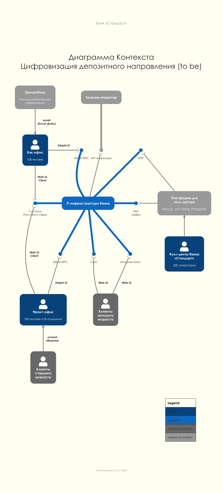
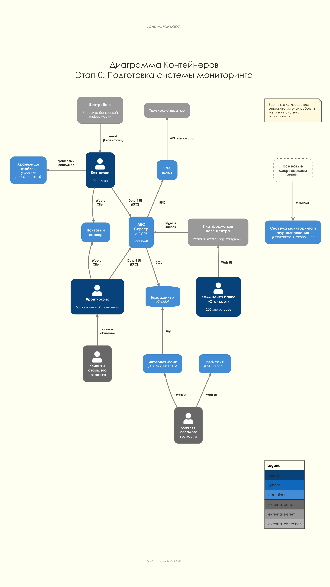
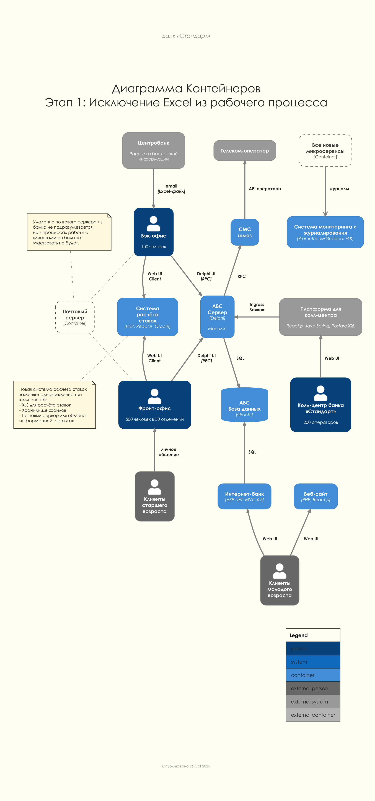
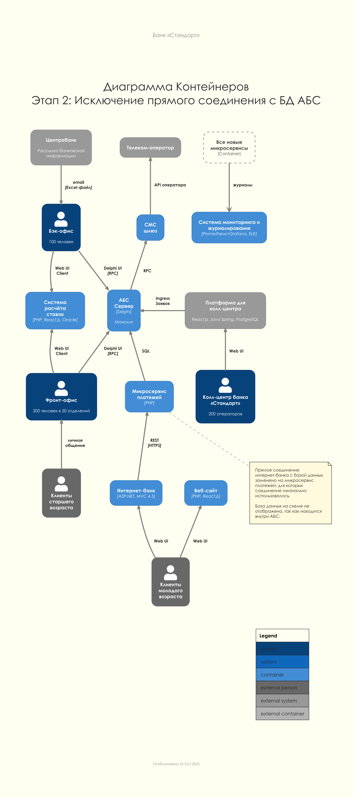
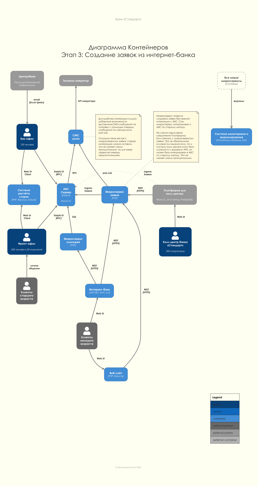
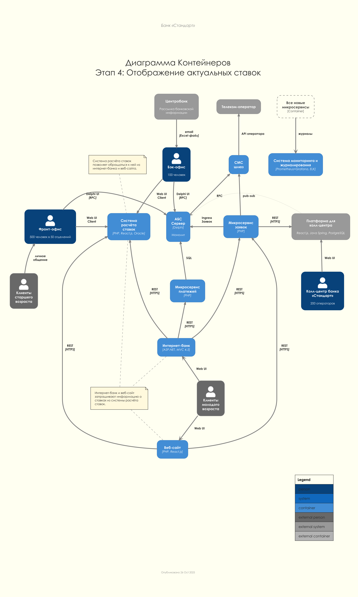
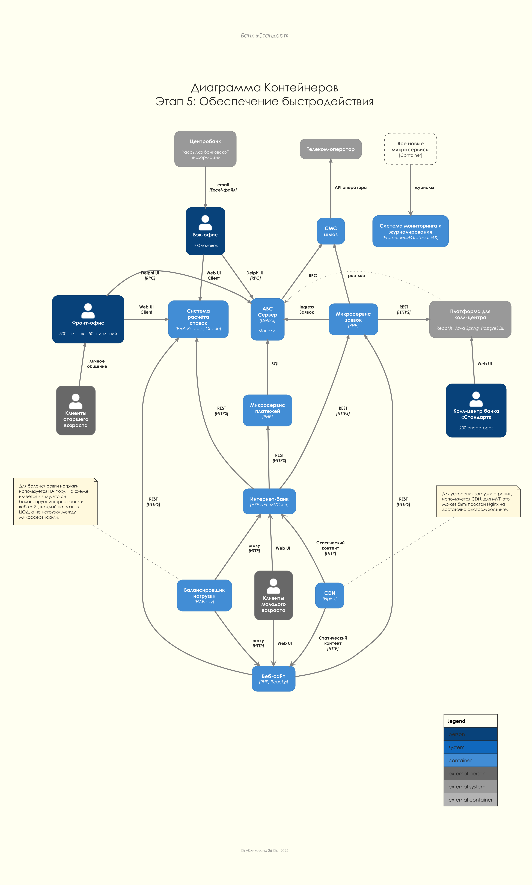
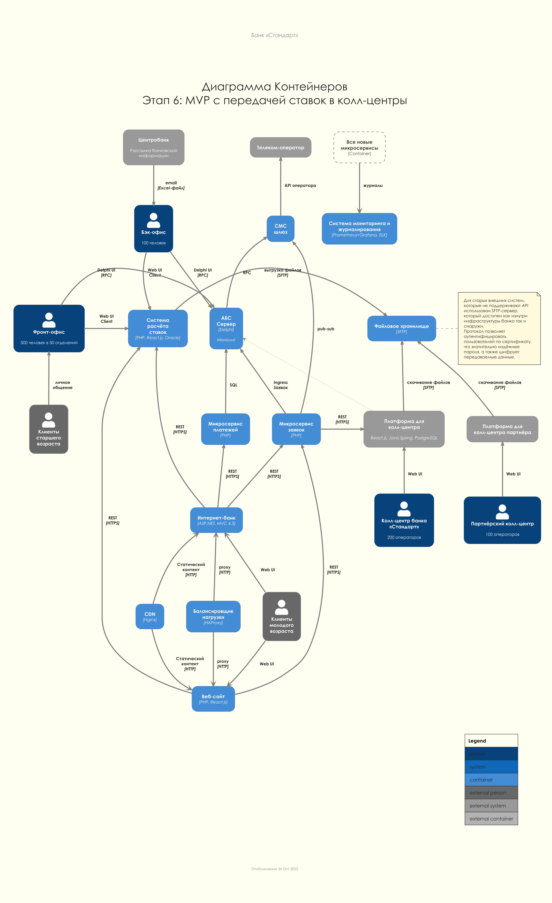
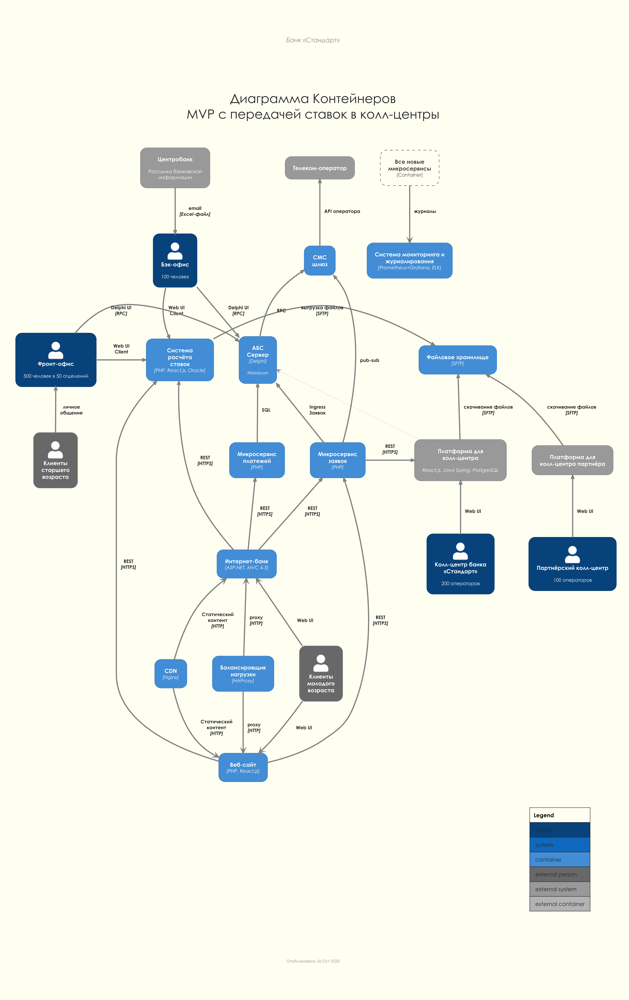
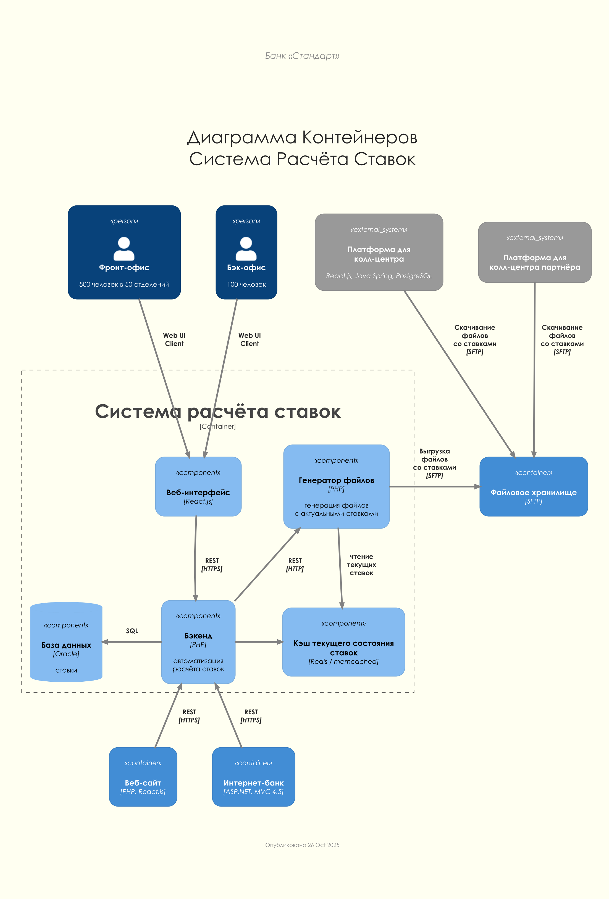

### Название задачи: Передача ставок в колл-центр
### Автор: ЦК Архитектуры
### Дата: 2025-10-25

### Use cases

### Решение

#### Context To Be

#### Container - План MVP

#### Container - Итоговая схема

#### Component To Be

### Покрытие FURPS решением

### Обоснование решений

Решения направлены на обеспечение доступа к актуальным депозитным ставкам для операторов колл-центров банка и партнёрского колл-центра. Это необходимо для качественной консультации клиентов, особенно пожилых людей, которые предпочитают получать информацию по телефону.

- **SFTP-выгрузка для систем колл-центров**
  
  Обе системы колл-центров (собственная и партнёрская) получают актуальные ставки в виде файлов через SFTP-сервер. Файлы генерируются автоматически при изменении ставок.
  - **Плюсы**:
    - **Соответствие ограничениям**: Системы колл-центров не могут делать API-вызовы, только файловый обмен.
    - **Безопасность**: SFTP обеспечивает шифрование при передаче файлов, SSH-ключи для аутентификации.
    - **Простота**: Файловый обмен — простой и надёжный способ интеграции с внешними системами.
    - **Асинхронность**: Колл-центры скачивают файлы по своему расписанию, не создавая нагрузку на системы банка в реальном времени.
    - **Единообразие**: Одна и та же архитектура для обоих колл-центров упрощает поддержку.
    - **Retry-механизм**: При сбое выгрузки система повторяет попытку.
    - **Аудит**: Все операции выгрузки логируются, есть алерты при сбоях.
    - **Версионирование**: Формат файлов версионируется для обратной совместимости.
    - **Независимость**: Колл-центры работают с локальными данными даже при недоступности SFTP-сервера.
  - **Минусы**:
    - **Задержка актуализации данных**: Колл-центры получают ставки с задержкой (5-15 минут в зависимости от расписания проверки).
    - **Дополнительная инфраструктура**: Требуется SFTP-сервер и его обслуживание.
    - **Ручная синхронизация при сбоях**: Если колл-центр не скачает файл, может работать с устаревшими данными.
    - **Сложность изменения формата**: Изменение формата файла требует согласования с обоими колл-центрами.
    - **Увеличение сложности системы расчёта ставок**: Добавление модуля выгрузки и SFTP-клиента.

- **Автоматическая генерация файлов при изменении ставок**
  
  Система расчёта ставок автоматически генерирует и выгружает файлы при изменении ставок (event-driven подход), а не только по расписанию.
  - **Плюсы**:
    - **Актуальность данных**: Колл-центры получают обновлённые ставки максимально быстро (в течение 1 минуты после изменения + время до следующей проверки).
    - **Оперативность**: Не нужно ждать следующего запланированного времени выгрузки.
    - **Автоматизация**: Менеджерам депозитов не нужно вручную инициировать выгрузку.
  - **Минусы**:
    - **Сложность реализации**: Требуется event-driven архитектура с обработкой событий изменения ставок.
    - **Риск частых выгрузок**: Если ставки меняются очень часто, может создаваться избыточная нагрузка на SFTP-сервер.

- **Раздельные директории для колл-центров**
  
  Система расчёта ставок выгружает файлы в отдельные директории для колл-центра банка и партнёрского колл-центра.
  - **Плюсы**:
    - **Безопасность**: Колл-центры не видят файлы друг друга, изолированный доступ.
    - **Гибкость**: Можно настроить разные форматы или частоту обновления для разных колл-центров.
    - **Аудит**: Легко отслеживать, какой колл-центр скачал файлы и когда.
  - **Минусы**:
    - **Усложнение конфигурации**: Необходимо настраивать SSH-ключи и права доступа для каждого колл-центра.

### Альтернативы

Альтернативы для передачи ставок в системы колл-центров
  
- **Прямое подключение систем колл-центров к базе данных системы расчёта ставок**
    - **Плюсы**:
      - Данные всегда актуальные в реальном времени.
      - Меньше промежуточных слоёв.
      - Не требуется SFTP-сервер.
    - **Минусы**:
      - Создаёт жёсткую связь между системами — изменение схемы БД системы расчёта ставок потребует изменений в системах колл-центров.
      - База данных Oracle дорогая в лицензировании — каждое подключение увеличивает стоимость.
      - Безопасность — прямой доступ к БД создаёт дополнительные риски утечки данных.
      - Система колл-центра банка управляется подрядчиком — предоставление им прямого доступа к БД рискованно.
      - Партнёрский колл-центр — внешняя организация, предоставление прямого доступа к БД категорически недопустимо.
      - Нет возможности контролировать и ограничивать запросы — могут создаваться тяжёлые запросы.

- **Email-рассылка файлов с актуальными ставками**
    - **Плюсы**:
      - Простота реализации — не требуется SFTP-сервер.
      - Привычный способ обмена файлами.
    - **Минусы**:
      - Безопасность — email менее защищён, чем SFTP. Данные о ставках могут быть коммерчески чувствительными.
      - Нет гарантии доставки — письма могут попадать в спам, теряться.
      - Сложность автоматизации на стороне партнёра — нужно парсить вложения из email.
      - Отсутствие аудита и контроля — сложно отследить, получил ли партнёр файл.

- **Веб-портал для скачивания файлов с актуальными ставками**
    - **Плюсы**:
      - Колл-центры могут скачивать файлы в любое удобное время.
      - Можно реализовать web-интерфейс для просмотра истории файлов.
      - HTTPS обеспечивает безопасность передачи.
    - **Минусы**:
      - Колл-центры должны заходить на портал вручную или реализовать автоматическое скачивание через HTTP API.
      - Требуется разработка и поддержка веб-портала.
      - Менее стандартный подход по сравнению с SFTP для B2B файлового обмена.
      - Необходимость управления доступом, аутентификацией через веб-интерфейс.

- **Ручная рассылка файлов (email от менеджера)**
    - **Плюсы**:
      - Не требуется никакой технической интеграции.
      - Максимально дёшево.
    - **Минусы**:
      - Высокий риск человеческой ошибки — менеджер может забыть отправить файл или отправить устаревшую версию.
      - Не масштабируется — при частом изменении ставок станет обузой.
      - Задержки — файл может быть отправлен не сразу после изменения ставок.
      - Зависимость от человеческого фактора.
      - Не подходит для партнёрского колл-центра из-за требований безопасности.

### Недостатки, ограничения, риски

#### Недостатки решения

- **Задержка данных для партнёрского кол-центра**
   - Партнёрский кол-центр получает ставки с задержкой до 15 минут (интервал между выгрузками).
   - Если ставки изменяются несколько раз в день, операторы партнёра могут консультировать клиентов по неактуальным данным.
   - Это может привести к недовольству клиентов и репутационным рискам.

- **Дополнительная инфраструктура**
   - Требуется SFTP-сервер для обмена файлами с партнёрским кол-центром.
   - SFTP-сервер нужно обслуживать, мониторить, обеспечивать его безопасность и доступность.
   - Увеличиваются операционные расходы на инфраструктуру.

- **Усложнение системы расчёта ставок**
   - Добавление модуля выгрузки и SFTP-клиента увеличивает сложность системы расчёта ставок.
   - Требуется поддержка нескольких форматов файлов (CSV, XML, JSON).
   - Усложняется процесс тестирования и развёртывания.

- **Зависимость от доступности API для системы кол-центра**
   - При недоступности API системы расчёта ставок операторы кол-центра не получат обновлённые данные.
   - Хотя кэширование смягчает проблему, при длительном сбое операторы будут работать с устаревшими ставками.

- **Необходимость доработки системы кол-центра**
   - Система кол-центра управляется подрядчиком, любые изменения требуют их участия.
   - Это может увеличить стоимость и время реализации.
   - Банк становится зависим от подрядчика для поддержки интеграции.

#### Ограничения решения

- **Формат файлов для партнёрского кол-центра фиксирован**
   - Формат файла согласовывается с партнёром и не может произвольно меняться.
   - Изменение формата требует согласования, тестирования на стороне партнёра и может занять недели.
   - Версионирование формата помогает, но усложняет поддержку.

- **Партнёрский кол-центр не может делать API-вызовы**
   - Это критичное ограничение, которое исключает более современные способы интеграции.
   - Партнёр работает во внешней информационной системе с ограниченными возможностями интеграции.

- **Задержка синхронизации при сбоях**
   - Если SFTP-сервер недоступен или партнёр не скачал файл, данные у партнёра устаревают.
   - Retry-механизм помогает, но не решает проблему полностью.

- **Зависимость от подрядчика**
   - Система кол-центра полностью поддерживается подрядчиком.
   - Любые изменения или исправления проблем требуют их участия.
   - Банк не может самостоятельно дорабатывать интеграцию.

#### Риски реализации

- **Риски безопасности**
   - **SFTP-сервер как цель атаки**: SFTP-сервер становится потенциальной точкой входа для злоумышленников.
   - **Утечка данных**: При неправильной настройке SFTP или SSH-ключей возможна утечка коммерчески чувствительной информации о ставках.
   - **Доступ партнёра**: Партнёрский кол-центр — внешняя организация. Необходимо строго контролировать, какие данные они получают.
   - **Кража SSH-ключей**: Если SSH-ключи партнёра будут скомпрометированы, злоумышленники могут получить доступ к SFTP-серверу.

- **Риски интеграции**
   - **Сложность интеграции с системой кол-центра**: Система управляется подрядчиком, координация может быть сложной.
   - **Несовместимость форматов**: Партнёр может неправильно интерпретировать формат файла, что приведёт к ошибкам.
   - **Риск недоступности SFTP-сервера**: При сбое SFTP-сервера партнёр не сможет получать обновления ставок.
   - **Проблемы с сетевым подключением**: Партнёр может испытывать проблемы с подключением к SFTP-серверу из-за сетевых проблем.

- **Организационные риски**
   - **Зависимость от подрядчика системы кол-центра**: Любые изменения требуют их участия, что увеличивает сроки и стоимость.
   - **Сопротивление операторов**: Операторы кол-центра могут быть не готовы к новому интерфейсу для просмотра ставок.
   - **Недостаток обучения**: Операторов нужно обучить работе с новым интерфейсом, что требует времени и ресурсов.
   - **Проблемы координации с партнёром**: Партнёрский кол-центр может не уделить достаточного внимания интеграции, что затянет сроки.

- **Технические риски**
   - **Сбои в модуле выгрузки**: Если модуль выгрузки упадёт, партнёр не получит обновлённые файлы.
   - **Проблемы с генерацией файлов**: Некорректная генерация файла может привести к ошибкам при импорте у партнёра.
   - **Переполнение SFTP-сервера**: Если старые файлы не удаляются, дисковое пространство может закончиться.
   - **Рассинхронизация данных**: При сбоях возможна рассинхронизация между системой расчёта ставок и системами кол-центров.
   - **Проблемы с кэшированием**: Некорректная настройка кэша может привести к тому, что операторы видят устаревшие данные.

- **Риски недооценки сроков и бюджета**
   - **Сложность реализации**: модуля выгрузки и SFTP-клиента может занять больше времени, чем планируется.
   - **Согласование формата с партнёром**: Процесс согласования формата файла может затянуться.
   - **Тестирование интеграции**: Тестирование с партнёром требует координации и может занять много времени.
   - **Непредвиденные доработки**: Подрядчик системы кол-центра может потребовать дополнительные изменения, увеличивающие стоимость.

- **Риски для бизнеса**
   - **Репутационные риски**: Ошибки в консультировании по ставкам могут нанести ущерб репутации банка.
   - **Перегрузка основного кол-центра**: Если партнёрский кол-центр не справится из-за проблем с получением данных, нагрузка вернётся на основной кол-центр.
   - **Потеря клиентов**: Пожилые клиенты могут отказаться от депозитов, если не смогут получить качественную консультацию по телефону.

#### Меры по снижению рисков

- **Безопасность**
   - Использование SSH-ключей для аутентификации на SFTP-сервере.
   - Регулярная ротация ключей и аудит доступа.
   - Шифрование данных при передаче и хранении.
   - Регулярные security-аудиты и penetration testing.

- **Мониторинг и алертинг**
   - Система мониторинга (Prometheus+Grafana) для отслеживания успешности SFTP-выгрузок.
   - Алерты при сбоях выгрузки, недоступности SFTP или превышении времени отклика.
   - Централизованное логирование (ELK) всех операций для аудита и отладки.
   - Дашборды для мониторинга ключевых метрик (задержка ответа, частота выгрузок, размер файлов).

- **Retry-механизмы и отказоустойчивость**
   - Retry-механизм для SFTP-выгрузки.
   - Резервный SFTP-сервер на случай сбоя основного.

- **Тестирование**
   - Автоматизированные тесты для выгруки файлов.
   - Интеграционные тесты с партнёрским кол-центром (в тестовой среде).
   - Тестирование сценариев сбоев (недоступность SFTP, сбой генерации файла).

- **Документация и обучение**
   - Подробная документация формата файлов для партнёра.
   - Обучение операторов кол-центра работе с новым интерфейсом для просмотра ставок.
   - Инструкции по устранению неполадок для службы поддержки.

- **Поэтапное внедрение**
   - Начать с интеграции с системой кол-центра банка, затем добавить для партнёра.
   - Пилотный запуск с ограниченной группой операторов перед полным развёртыванием.
   - Постепенное увеличение нагрузки и мониторинг производительности.

- **Координация с партнёром и подрядчиком**
   - Регулярные встречи с подрядчиком системы кол-центра для координации работ.
   - Чёткое согласование формата файлов с партнёрским кол-центром и его версионирование.
   - SLA с партнёром на время обработки файлов и уведомления о проблемах.
