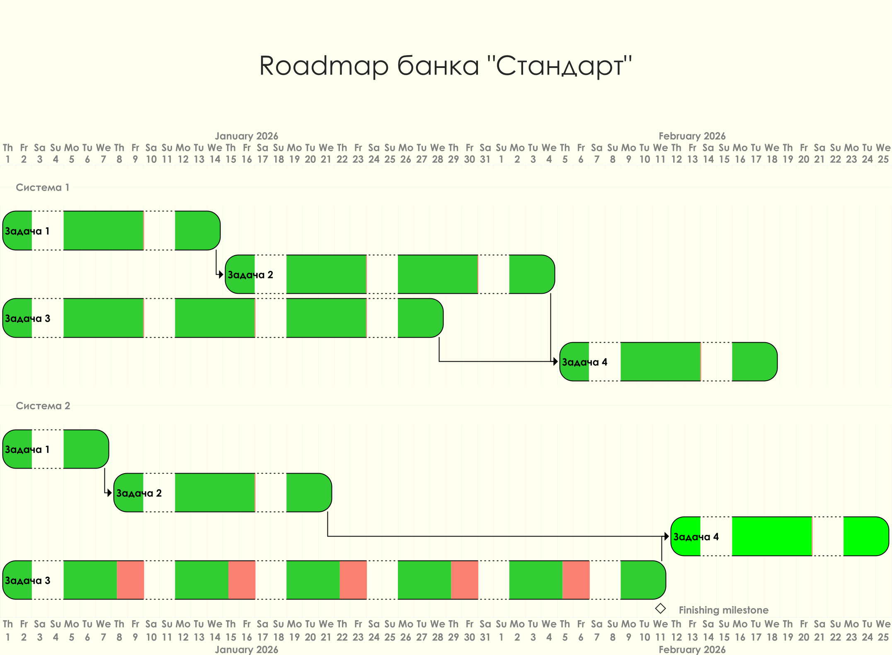

# Задание 4. Передача ставок в кол-центр

## Описание задачи

Менеджер проектов из команды цифровой трансформации занимается подготовкой дорожной карты проекта. Для этого ему нужно определить, в какой последовательности команды должны делать изменения в своих системах. Понять это поможет архитектура MVP, которую вы спроектировали ранее.

## Проблема

Также команда обнаружила проблему: большинство клиентов банка «Стандарт» — пожилые люди. Как только банк запустит маркетинговую кампанию на текущих и на новых клиентов, количество звонков в кол-центр может увеличиться. Есть риск, что возрастным людям будет непросто сориентироваться в новых процессах и они захотят уточнить условия открытия депозита по телефону.

## Предложения по решению

В ходе анализа проблемы сотрудники банка внесли несколько предложений:

- **Доступ к ставкам для кол-центра**: Нужно, чтобы сотрудники кол-центра могли проконсультировать клиентов хотя бы по текущим ставкам банка. Для этого надо каким-то образом предоставить их системе доступ к ставкам по депозитам.

- **Подключение партнёрского кол-центра**: Есть риск, что кол-центр будет перегружен. Поэтому необходимо подключить к работе партнёрский кол-центр. При этом важно, чтобы сотрудники партнёрского кол-центра также могли проконсультировать клиентов по актуальным депозитным ставкам. Для этого нужно наладить процесс передачи информации об актуальных ставках между банком и кол-центром. Кол-центр партнёра работает во внешней информационной системе относительно банка. Они готовы получать актуальные ставки в виде файлов. Нет возможности сделать API-вызовы (например, через SFTP-протокол).

- **Учёт изменений в MVP**: Все эти изменения необходимо учесть в MVP и предложить решение на основе текущего процесса работы со ставками.

## Что нужно сделать

### 1. Разработка ADR
Разработайте ADR для новых изменений. Ещё раз заполните шаблон ADR, на этот раз — для нового кейса. Опишите там:
- Use Cases
- Функциональные и нефункциональные требования
- Создайте диаграммы контекста и компонентов в модели C4
- Опишите альтернативы и недостатки для вашего решения

> **Примечание**: При разработке диаграмм учитывайте и используйте только то, что имеет значение для текущих изменений.

### 2. Планирование задач
Сформируйте список крупных задач для каждой системы из ADR для будущего планирования.

### 3. Подготовка RoadMap
Подготовьте RoadMap в draw.io. Это схема последовательности выполнения задач для MVP на горизонте 6 месяцев с учётом изменений в новом кейсе и целевого решения на горизонте года.

**Пример формата**: [roadmap-template.drawio](roadmap-template.drawio), [roadmap-template.puml](roadmap-template.puml)

## Результат

Когда всё будет готово, загрузите решение в директорию Task4 в рамках пул-реквеста.